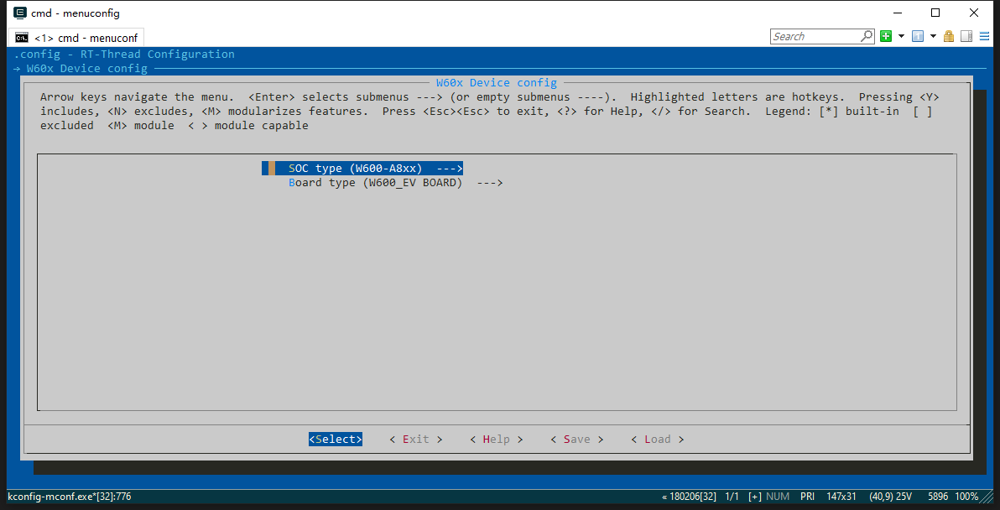

# ESPush W60X 固件

WiFi 远程控制固件

# 准备工作

本固件基于 rt-thread 的 w60x bsp，点击[此处下载](https://www.rt-thread.org/page/download.html) RT-Thread 的 windows 平台 Env 控制台增强工具。此工具极大增强了 windows 下命令行能力，即使您不进行 rt-thread 开发也有下载的必要。如果您已有 env 开发工具，则无需重复下载。工具的使用教程可以看[这里](https://www.rt-thread.org/document/site/tutorial/env-video/)或[这里](https://www.rt-thread.org/document/site/programming-manual/env/env/)。

本仓库工程基于 W601_IoT_Board，所以需要克隆 w60x 的 bsp 代码仓库，执行 `git clone https://github.com/RT-Thread/W601_IoT_Board.git`，如果 github 下载速度太慢，执行 `git clone https://gitee.com/Armink/W601_IoT_Board.git` 使用国内码云镜像，会有更好的克隆速度。

配置 `W60X_ROOT` 环境变量 为 刚下载的 W601_IoT_Board 完整路径。配置 `RTT_ROOT` 环境变量 %W60X_ROOT%\rt-thread。

# 固件编译
本代码固件使用 rt-thread 的 scons 构建系统，关于 rt-thread 的构建系统，具体教程请[参考此处](https://www.rt-thread.org/document/site/programming-manual/scons/scons/)。

使用 env 工具，到本工程根目录，执行 menuconfig 命令，选择 `W60x Device config` 选择 `SOC type (*******)` 可选择 `W600` 或 `W601` 如下图所示:

连续选择 `Exit` 退出 menuconfig 工具，收到 `Do you wish to save your new configuration?` 提示时，选择 `Yes` 生成 rtconfig.h。

执行 scons 即可开始编译过程。
